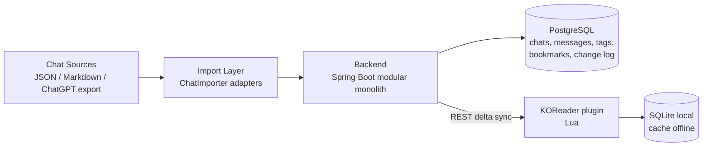
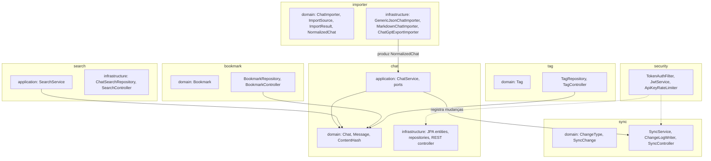
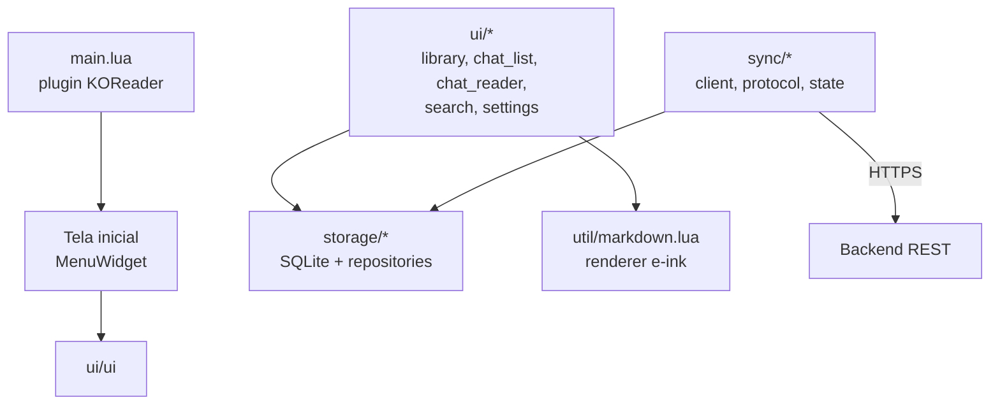

# Arquitetura

> Status: proposta para aprovação (Etapa 1 — Discovery).

## 1. Visão geral

O **Chat Reader** é um sistema de duas partes independentes, conectadas apenas por uma
API REST de delta sync:

| Parte    | Tecnologia                  | Papel                                             |
|----------|-----------------------------|---------------------------------------------------|
| Backend  | Java 21 + Spring Boot 3.x   | Source of truth do conteúdo, importação e busca   |
| Kindle   | Lua 5.1/LuaJIT + KOReader   | Cliente offline-first de leitura                  |
| Banco    | PostgreSQL 16 (backend)     | Catálogo, busca full-text, change log             |
| Banco    | SQLite (Kindle)             | Réplica local de leitura                          |

O backend é um **modular monolith** (ADR-001). O Kindle é um **cliente** (ADR-002): não
importa, não busca no servidor em tempo de leitura e não depende do backend para funcionar.



## 2. Backend — módulos

Cada módulo é um pacote com três camadas (`domain`, `application`, `infrastructure`) e
depende apenas de `domain`. A regra é: **nenhum módulo importa outro módulo**; a coordenação
acontece em `application` através de interfaces de porta definidas pelo módulo consumidor.



### Decisões de estrutura

- **Sem `infrastructure` genérica vazia.** Só existe o que é usado.
- **Interfaces (`ports`) apenas onde há mais de uma implementação ou fronteira externa**:
  `ChatImporter`, `ChatRepository` (só se necessário), `ChangeLog`. Nada mais.
- **DTOs de API separados das entidades JPA.** O formato de sync é estável e não deve
  quebrar quando o modelo interno mudar.
- **Transação por operação de escrita.** A escrita no change log acontece na mesma
  transação da mutação — nunca em `@TransactionalEventListener(AFTER_COMMIT)`, que abriria
  uma segunda transação e poderia perder mudanças.

## 3. Camadas

```text
REST controller        → valida (Bean Validation), delega, mapeia DTO
application service    → transação, orquestração, regras
domain                 → regras puras, sem dependência de Spring/JPA
infrastructure         → JPA, Jackson, adapters de importador
```

Regras de dependência: `infrastructure → application → domain`. Nunca o inverso.
O domínio não importa `jakarta.persistence`, `com.fasterxml` nem nada de Spring.

Exceção única e documentada: entidades JPA ficam em `infrastructure`, no domínio existem
classes puras (`Chat`, `Message`, `Role`) com comportamento.

## 4. Backend — decisões técnicas

| Tema                | Decisão                                                                    | Motivo                                                        |
|---------------------|----------------------------------------------------------------------------|---------------------------------------------------------------|
| Build               | Maven (wrapper `mvnw`)                                                     | ubiquitous, suportado pelo Docker multi-stage sem instalar nada |
| Banco               | PostgreSQL 16                                                              | `tsvector`/GIN resolve busca sem Elasticsearch (ADR-006)      |
| Migrations          | Flyway `V1..V5`                                                            | `ddl-auto=validate` sempre; schema nunca inferido              |
| Busca               | `websearch_to_tsquery` + GIN + `ts_headline` para snippet                   | full-text real, zero infraestrutura extra                      |
| Autenticação        | JWT Bearer HS256, expiração 30d, secret em `${JWT_SECRET}`                 | simples, stateless, compatível com cliente Lua                 |
| Rate limit          | Token bucket em memória por IP, só em `/api/sync` e `/api/chats/import`    | protege sem Redis (§41 proíbe Redis sem necessidade)           |
| Observabilidade     | Logback JSON + Actuator (micrometer) com contadores customizados            | métricas `imports_total`, `sync_requests_total`, ...            |
| Limites             | Upload ≤ 10 MB, payload de import ≤ 5 MB, `q` ≤ 200 chars                  | Kindle e e-ink pedem limites explícitos                       |
| API docs            | springdoc-openapi 2.x → `/swagger-ui.html`                                 | requisito do §36                                              |

### Busca full-text sem dependências novas

Migration `V6__add_search_vector.sql` cria coluna gerada:

```sql
ALTER TABLE messages ADD COLUMN search_vector tsvector
  GENERATED ALWAYS AS (to_tsvector('portuguese', coalesce(content, ''))) STORED;
CREATE INDEX idx_messages_search_vector ON messages USING GIN (search_vector);
```

A consulta une `messages.search_vector @@ websearch_to_tsquery('portuguese', ?)` com
`chats.title ILIKE` e `EXISTS (SELECT 1 FROM chat_tags ...)` para busca por tag. O
`ORDER BY ts_rank DESC, c.updated_at DESC` dá ranqueamento sem modelo extra.

## 5. Kindle — arquitetura

O plugin segue convenções reais do KOReader: `main.lua` como ponto de entrada
(`PluginManager:new{ file = "main.lua" }` retorna plugin com `onShow`/`onClose`),
widgets de menu via `ui.menu`, e `MenuWidget:new{ title = ..., item_table = ... }` para
listagens.



Fluxo de dados no Kindle:

```text
ui/*  →  storage/repositories/*  →  SQLite (sempre)
                ↕
       sync/state.lua (lastSyncVersion, pendingChanges)
                ↕
       sync/client.lua (SocketHttp + ssl)  →  GET /api/sync
                ↓
       aplica changes em transação  →  grava sync_state  →  POST /api/sync/ack
```

Regras do cliente (ADR-002, ADR-005, §47):

1. **Nenhuma tela chama HTTP.** Só `ui/settings.lua` (ação "Sincronizar") aciona o sync.
   Sem polling, sem retry agressivo, sem animação.
2. **Tela de leitura nunca carrega a conversa inteira.** Janela de 20 mensagens
   (`MESSAGES_PAGE_SIZE`) carregada sob demanda com `LIMIT/OFFSET` indexado.
3. **Busca é sempre local** (SQLite `LIKE` / FTS se disponível), mesmo online. Evita
   latência de rede no e-ink e funciona offline.
4. **Refresh só após ação do usuário.** `UIManager:showInfo` e redesenho da lista apenas
   quando o dado muda.
5. **Escrita local antes de remota.** Favorito e bookmark persistem no SQLite na hora e
   entram na fila `pending_changes`; a rede é oportunista.

### Markdown renderer

`util/markdown.lua` processa **linha a linha em um único passe**, sem construir AST e sem
alocar tabelas grandes. Ordem de prioridade do §22 com fallback para texto legível:

```text
headings → code fence → list (ordenada/não ordenada) → blockquote → tabela simples
→ inline: **bold** *italic* `code` [link](url) → parágrafo/quebra
```

Código é renderizado como moldura ASCII com prefixo por linha:

```text
┌───────────────────────────
│ @Transactional
│ public void process() {}
└───────────────────────────
```

Tabelas complexas e imagens caem para o texto Markdown literal legível.

## 6. Segurança

- **HTTPS obrigatório** fora de localhost. O cliente Lua aceita `http://` apenas com
  confirmação explícita nas settings (flag `allow_insecure_http`).
- **JWT** em header `Authorization: Bearer`. Segredo nunca no repositório (`.env`).
- **No logs nunca**: token, senha, corpo de mensagem completo. Mensagens só entram em log
  como `messageId` + tamanho.
- **Importação**: tamanho máximo, limite de chats por arquivo, `try/catch` por chat para que
  um item malformado não derrube o lote inteiro; resultado reporta `failed`.
- **Limitação conhecida e documentada**: sem refresh token, sem revogação, sem multiusuário.
  Adequado ao MVP de usuário único.

## 7. O que deliberadamente **não** existe

Sem chat em tempo real, sem geração de resposta, sem streaming, sem microsserviços,
sem Kubernetes, sem Kafka, sem Redis, sem Elasticsearch, sem WebSocket, sem OAuth,
sem asset pipeline de frontend. O Kindle renderiza texto; o backend serve JSON.
