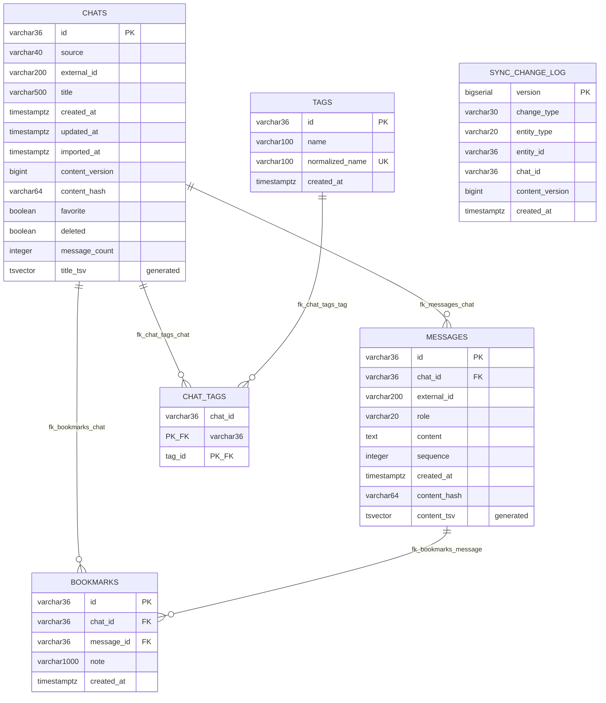

# Data Model — Chat Reader for Kindle

> Living documentation of the application's data model.
> Updated whenever entities, attributes, access patterns, constraints, indexes,
> or modeling decisions change.

Derivado do código: migrations `V1`–`V6` em
`backend/src/main/resources/db/migration/`, entidades em
`*/infrastructure/*Entity.java` e queries em `ChatJpaRepository`,
`MessageJpaRepository`, `BookmarkJpaRepository`, `ChangeLogJpaRepository`,
`TagRepositoryAdapter` e `SearchQueryRepository`.

---

## Overview

O modelo persistido é a **fonte da verdade do conteúdo** das conversas (ADR-005). Ele
não é event-sourced: guarda o estado corrente de cada agregado, mais um *change log*
de metadados usado exclusivamente como cursor de sincronização.

Perguntas que a seção responde:

- **Fonte da verdade?** Sim, para o conteúdo. O SQLite do Kindle é cache local.
- **Read model ou projeção?** Não. As colunas `title_tsv` e `content_tsv` são
  projeções derivadas, geradas pelo próprio Postgres.
- **Preserva histórico?** Parcialmente. O conteúdo não tem histórico; o
  `sync_change_log` guarda *que* mudou, e as versões antigas são destruídas na
  próxima importação. `content_version` é um contador, não um snapshot.
- **Event-sourced?** Não. Nenhum estado é reconstruído a partir de eventos.
- **Modelo relacional?** Sim, relacional puro com busca full-text do PostgreSQL.
- **Dono dos dados?** O backend, um monolito modular (ADR-001).

## Storage Technology

| Item | Value |
|---|---|
| Database | PostgreSQL 16 |
| Version | 16 (`postgres:16-alpine`, inclusive nos testes via Testcontainers) |
| Data access | Spring Data JPA (`Hibernate`) **e** `NamedParameterJdbcTemplate` |
| Schema management | Flyway (`baseline-on-migrate: true`, `classpath:db/migration`) |
| Local environment | Docker Compose (`postgres` + `backend`) |
| Service owner | `chat-reader-backend` |
| Extensão | nenhuma — full-text usa `tsvector`/`GIN` nativos |
| DDL automático | **desligado**: `spring.jpa.hibernate.ddl-auto: validate` |

Duas Technologies de acesso convivem de propósito:

| Onde | Tecnologia | Motivo |
|---|---|---|
| `chat`, `bookmark`, `sync` | Spring Data JPA / Hibernate | agregados simples, `save`/`saveAll` bastam |
| `tag` | `NamedParameterJdbcTemplate` | precisa de `ON CONFLICT DO NOTHING` e de upsert por `normalized_name`; JPA não expressa isso limpo |
| `search` | `NamedParameterJdbcTemplate` | SQL com `tsvector`, `LATERAL` e `UNION ALL` — fora do alcance do JPQL legível |

`application.yml` também fixa `open-in-view: false` e `jdbc.batch_size: 100` com
`order_inserts`/`order_updates` ligado — a importação de 10.000 conversas depende
disso para não emitir um INSERT por linha.

## Access Patterns

Somente queries que existem no código.

| ID | Operation | Input | Result | Frequency | Mechanism |
|---|---|---|---|---|---|
| AP-01 | Listar conversas | `page`, `size`, `favorite?`, `tag?` | `PageResponse<ChatSummary>` | High | `ChatJpaRepository.findActive` / `findFavorites` + `idx_chats_updated_at` |
| AP-02 | Ler uma conversa | `id` | `ChatDetail` | High | `findActiveById` — chave primária |
| AP-03 | Paginar mensagens | `chat_id` (path), `page`, `size` | `PageResponse<Message>` | High | `findByChatId(chatId, Pageable)` + `uq_messages_chat_sequence`. **Ordem não é garantida**: o `Pageable` é construído sem `Sort` |
| AP-04 | Contar mensagens de um chat | `chat_id` | `long` | Medium | `countByChatId` + `uq_messages_chat_sequence` |
| AP-05 | Importar: localizar existente | `source`, `external_id` \| `content_hash` | `Optional<Chat>` | Medium | `findBySourceAndExternalIdAndDeletedFalse` / `findBySourceAndContentHashAndDeletedFalse`, com índice único parcial como backstop |
| AP-06 | Busca full-text | `q`, `page`, `size` | hits com snippet | Medium | `SearchQueryRepository` + `idx_messages_content_tsv` / `idx_chats_title_tsv` |
| AP-07 | Listar tags | — | `TagsResponse` | Low | `TagRepositoryAdapter.findAll` |
| AP-08 | Tags de um chat | `chat_id` | `List<String>` | High | `tagsOf` + `chat_tags` PK |
| AP-09 | Chats com uma tag | `tag name`, paginação | `PageResponse<ChatSummary>` | Low | `chatIdsWithTag` + `idx_chat_tags_tag`, paginação **em memória** |
| AP-10 | Delta de sync | `since`, `limit` | `SyncDelta` | High | `findByVersionGreaterThanOrderByVersionAsc` + `idx_sync_change_log_version` |
| AP-11 | Snapshot paginado | `page`, `size` | `SyncSnapshot` | Medium | `findActive(Pageable)` |
| AP-12 | Bookmarks de um chat | `chat_id` | `List<Bookmark>` | Medium | `findByChatIdOrderByCreatedAtDescIdDesc` + `idx_bookmarks_chat` |
| AP-13 | Bookmark por (chat, mensagem) | `chat_id`, `message_id` | `Optional<Bookmark>` | Medium | `uq_bookmarks_chat_message` |
| AP-14 | Token corrente do sync | — | `long` | High | `MAX(version)` vs `pg_sequence_last_value(...)` |
| AP-15 | Podar change log | `cutoff` | `int` | Low | `deleteOlderThan` / `deleteUpToVersion` + `idx_sync_change_log_created` |

## Logical Model

O modelo **de domínio** e o **de persistência** não são o mesmo objeto, e a
documentação trata os três separadamente.

| Camada | Objeto | Onde vive |
|---|---|---|
| Domínio | `Chat` (agregado, invariantes, `contentVersion` monotônico) | `chat/domain/Chat.java` |
| Domínio | `Message` (imutável, `contentHash` calculado na factory) | `chat/domain/Message.java` |
| Domínio | `Bookmark` | `bookmark/domain/Bookmark.java` |
| Domínio | `ChatSource`, `Role`, `ContentHash` | `chat/domain/` |
| Persistência | `ChatEntity`, `MessageEntity`, `BookmarkEntity`, `ChangeLogEntity` | `*/infrastructure/*Entity.java` |
| Persistência | `tags` / `chat_tags` (sem entidade JPA) | `TagRepositoryAdapter` (JDBC) |
| API DTO | `ChatDtos`, `SearchDtos`, `SyncDtos`, `BookmarkDtos`, `TagDtos` | `*/infrastructure/*Dtos` (records) |
| Evento de sync | `SyncChange` (só metadados) | `sync/domain/SyncChange.java` |

Diferenças que importam:

- `ChatEntity` **não tem** `@OneToMany` para mensagens. A listagem de 50 conversas não
  pode carregar milhares de mensagens junto; as mensagens vêm sob demanda por AP-03.
- `Chat.contentVersion` existe no domínio mas **não** é `@Version` do JPA. É payload
  de sync, não controle de concorrência (ver ADR-DM-004).
- `Role` no banco é `VARCHAR(20)` com CHECK, não um tipo enum do Postgres.
- O `content_hash` no chat é derivado; o `content_hash` da mensagem também, mas
  calculado no domínio e congelado no objeto imutável.

## Data Model Diagram



`SYNC_CHANGE_LOG` é propositalmente **desconectada**: não há FK para `chats`, porque a
linha precisa sobreviver ao que descreve (inclusive à remoção) e porque o payload é
montado na leitura.

## Entities

### Chat

> Agregado raiz do conteúdo. Uma conversa importada.

**Storage:** `chats`
**Owning service:** `chat-reader-backend`, módulo `chat`

Responsabilidade: identidade, título, contadores de versão e hash, estado de favorito,
tombstone e o total de mensagens (desnormalizado para a biblioteca do Kindle não
precisar de `COUNT(*)`). As mensagens vivem em `messages`.

Ciclo de vida: criada pela importação (`source` + `external_id` ou `content_hash`);
atualizada por reimportação com conteúdo diferente, por favorito e por tags;
**removida** por `ChatService.delete`, que faz *tombstone* (ver Data Lifecycle).

### Message

> Uma mensagem de conversa. Conteúdo cru, nunca renderizado no backend.

**Storage:** `messages`
**Owning service:** módulo `chat`

Responsabilidade: texto, papel, ordem dentro da conversa e identidade externa.
A ordenação é por `sequence`, não por timestamp — exports reais têm datas ausentes
ou duplicadas.

### Tag

> Etiqueta canônica, compartilhada entre conversas, deduplicada sem diferenciar maiúsculas.

**Storage:** `tags`
**Owning service:** módulo `tag`

`name` é o texto exibido como a pessoa digitou; `normalized_name` é a chave de
deduplicação (`strip`, corta em 100, `toLowerCase(Locale.ROOT)`). `"Java"` e `"java"`
são a mesma tag com `uq_tags_normalized`.

### ChatTag

> Junção N:N entre conversa e tag.

**Storage:** `chat_tags`
**Owning service:** módulo `tag`

A associação é **reescrita inteira** a cada `save` do agregado (poucas tags por
conversa), então não há `created_at` nem estado intermediário. A gravação usa
`INSERT ... ON CONFLICT DO NOTHING` para ser segura contra corrida.

### Bookmark

> Marcador de uma mensagem específica, para retomar a leitura onde parou.

**Storage:** `bookmarks`
**Owning service:** módulo `bookmark`

`id` é escolhido pelo cliente no caminho do ACK (o plugin usa o **id da mensagem**),
o que torna o `POST` idempotente e o marcador legível nas duas pontas.
`uq_bookmarks_chat_message` impede dois marcadores para a mesma mensagem.

### SyncChangeLog

> Cursor monotônico de sincronização. Guarda metadados, nunca conteúdo.

**Storage:** `sync_change_log`
**Owning service:** módulo `sync`

A coluna `version` (`BIGSERIAL`) **é** o token do cliente. Deliberadamente não é
`updated_at`: colide em lote, não sobrevive a ajuste de relógio e não registra remoção.
O payload (chat, bookmark, tag) é montado na leitura, a partir do estado atual — assim
o cliente nunca recebe um snapshot congelado no passado.

### Field Dictionary

#### `chats`

| Field | SQL Type | Nullable | Default | Description |
|---|---|---|---|---|
| `id` | `VARCHAR(36)` | no | — | UUID v4 gerado na aplicação. PK. |
| `source` | `VARCHAR(40)` | no | — | `ChatSource` (`CHATGPT_EXPORT`, `JSON`, `MARKDOWN`), gravado como string |
| `external_id` | `VARCHAR(200)` | yes | `NULL` | Id do exportador. Ausente em Markdown → idempotência cai para `content_hash` |
| `title` | `VARCHAR(500)` | no | — | Nunca vazio (CHECK); `normalizeTitle` substitui por `"Conversa sem titulo"` e corta em 500 |
| `created_at` | `TIMESTAMPTZ` | yes | `NULL` | `Instant` do exportador; `NULL` quando a origem não traz data |
| `updated_at` | `TIMESTAMPTZ` | yes | `NULL` | Mesma origem. Base do orden da biblioteca |
| `imported_at` | `TIMESTAMPTZ` | yes | `NULL` | Momento da importação (metadado do backend, não do exportador) |
| `content_version` | `BIGINT` | no | `1` | Contador monotônico por chat. **Não** é version de lock. CHECK `> 0` |
| `content_hash` | `VARCHAR(64)` | no | — | SHA-256 hex minúsculo do conteúdo canônico (ver Idempotency) |
| `favorite` | `BOOLEAN` | no | `FALSE` | Flag bidirecional, LWW |
| `deleted` | `BOOLEAN` | no | `FALSE` | Soft delete. Só `chats` tem |
| `message_count` | `INTEGER` | no | `0` | Denormalizado. CHECK `>= 0` |
| `title_tsv` | `tsvector` | yes | — | **Gerado** `STORED` de `title`. Nunca escrito pela aplicação |

#### `messages`

| Field | SQL Type | Nullable | Default | Description |
|---|---|---|---|---|
| `id` | `VARCHAR(36)` | no | — | UUID v4 novo a cada importação; **não** participa do hash |
| `chat_id` | `VARCHAR(36)` | no | — | FK → `chats(id)` `ON DELETE CASCADE` |
| `external_id` | `VARCHAR(200)` | yes | `NULL` | Id da mensagem no exportador |
| `role` | `VARCHAR(20)` | no | — | CHECK em `('USER','ASSISTANT','SYSTEM','TOOL','UNKNOWN')` |
| `content` | `TEXT` | no | — | Markdown **cru**. O backend nunca renderiza |
| `sequence` | `INTEGER` | no | — | Ordem na conversa, ≥ 0, única por chat |
| `created_at` | `TIMESTAMPTZ` | yes | `NULL` | Instante da mensagem |
| `content_hash` | `VARCHAR(64)` | no | — | SHA-256 de `role + "\0" + content` |
| `content_tsv` | `tsvector` | yes | — | **Gerado** `STORED` de `content` |

#### `tags` / `chat_tags`

| Field | SQL Type | Nullable | Default | Description |
|---|---|---|---|---|
| `tags.id` | `VARCHAR(36)` | no | — | PK |
| `tags.name` | `VARCHAR(100)` | no | — | Exibido como digitado. CHECK não vazio |
| `tags.normalized_name` | `VARCHAR(100)` | no | — | `UNIQUE`. Chave de deduplicação case-insensitive |
| `tags.created_at` | `TIMESTAMPTZ` | no | `now()` | |
| `chat_tags.chat_id` | `VARCHAR(36)` | no | — | PK + FK → `chats` CASCADE |
| `chat_tags.tag_id` | `VARCHAR(36)` | no | — | PK + FK → `tags` CASCADE |

#### `bookmarks`

| Field | SQL Type | Nullable | Default | Description |
|---|---|---|---|---|
| `id` | `VARCHAR(36)` | no | — | PK. No ACK vem do cliente e é o `message_id` |
| `chat_id` | `VARCHAR(36)` | no | — | FK → `chats` CASCADE |
| `message_id` | `VARCHAR(36)` | no | — | FK → `messages` CASCADE |
| `note` | `VARCHAR(1000)` | yes | `NULL` | Nota livre do usuário |
| `created_at` | `TIMESTAMPTZ` | no | `now()` | |

#### `sync_change_log`

| Field | SQL Type | Nullable | Default | Description |
|---|---|---|---|---|
| `version` | `BIGSERIAL` | no | sequence | PK. **É** o token do cliente |
| `change_type` | `VARCHAR(30)` | no | — | CHECK com 12 valores |
| `entity_type` | `VARCHAR(20)` | no | — | CHECK em `('CHAT','MESSAGE','TAG','BOOKMARK')` |
| `entity_id` | `VARCHAR(36)` | no | — | Id da entidade alterada. Sem FK, de propósito |
| `chat_id` | `VARCHAR(36)` | yes | `NULL` | Chat relacionado, para o cliente filtrar |
| `content_version` | `BIGINT` | yes | `NULL` | Versão do chat no momento da mudança |
| `created_at` | `TIMESTAMPTZ` | no | `now()` | Base da retenção |

## Relationships

| Relação | Tipo | Persistida? | Comportamento |
|---|---|---|---|
| Chat → Message | 1:N | sim, FK | `ON DELETE CASCADE`; na prática nunca dispara por cascade porque a remoção é tombstone |
| Chat ↔ Tag | N:N | sim, tabela de junção | `chat_tags` com PK composta; reescrita a cada save |
| Tag → Chat | N:N | sim, mesma junção | `idx_chat_tags_tag` inverte o acesso |
| Chat → Bookmark | 1:N | sim, FK CASCADE | Apagados **na mão** no tombstone, não por cascade |
| Message → Bookmark | 1:N | sim, FK CASCADE | |
| Chat → SyncChange | 1:N **lógica** | **não** — sem FK | Ver [ADR-DM-002] |

Não há relacionamento persistido entre `sync_change_log` e `chats`. A associação é
reconstituída na leitura pelo `entity_id`/`chat_id`, e é por isso que a tabela
sobrevive ao que descreve.

## Value Objects and Nested Structures

Não há colunas JSONB, documentos embutidos nem mapas aninhados. A decisão está em
[ADR-DM-001].

Há, porém, **objetos de valor no domínio** que não viram coluna própria:

| Objeto | Composição | Onde é materializado |
|---|---|---|
| `ContentHash` | SHA-256 hex de `title` + `N × (sequence, role, messageHash)` | `chats.content_hash` |
| `Message.contentHash` | SHA-256 hex de `role + "\0" + content` | `messages.content_hash` |
| `TagNames.key(name)` | `strip` + corte em 100 + `toLowerCase(ROOT)` | `tags.normalized_name` |

## Enums and Value Domains

### Role (`chat.domain.Role` → `messages.role`)

| Value | Meaning |
|---|---|
| `USER` | Fala da pessoa |
| `ASSISTANT` | Resposta do modelo |
| `SYSTEM` | Instrução de sistema — preservada de propósito, o backend não a descarta |
| `TOOL` | Resultado/chamada de ferramenta |
| `UNKNOWN` | Papel ausente ou irreconhecível na origem |

O CHECK do banco tem exatamente estes cinco valores. `RoleMapper` mapeia dozens de
apelidos (`human`, `prompt`, `gpt`, `model`, `claude`, `gemini`, …) para `USER`/
`ASSISTANT`; desconhecido **nunca** falha a importação, vira `UNKNOWN`.

### ChatSource (`chat.domain.ChatSource` → `chats.source`)

| Value | Meaning |
|---|---|
| `JSON` | Schema genérico v1 |
| `MARKDOWN` | Transcrição Markdown |
| `CHATGPT_EXPORT` | `conversations.json` do ChatGPT |

`VARCHAR(40)` sem CHECK — o enum da aplicação é a única restrição.

### ImportFormat (`importer.domain.ImportFormat`)

`JSON`, `MARKDOWN`, `CHATGPT_EXPORT`. Não é persistido: só parâmetro de request.

### ChangeType (`sync.domain.ChangeType` → `sync_change_log.change_type`)

| Value | Written by `ChangeLogWriter`? |
|---|---|
| `CHAT_CREATED`, `CHAT_UPDATED`, `CHAT_DELETED` | sim |
| `BOOKMARK_CREATED`, `BOOKMARK_DELETED` | sim |
| `TAG_CREATED` | sim |
| `MESSAGE_CREATED`, `MESSAGE_UPDATED`, `MESSAGE_DELETED` | **não** — aceitos pelo CHECK, nunca emitidos |
| `TAG_UPDATED`, `TAG_DELETED` | **não** — idem |
| `BOOKMARK_UPDATED` | **não** — idem |

Ver [Known Limitations](#known-limitations).

### EntityType (`sync_change_log.entity_type`)

`CHAT`, `MESSAGE`, `TAG`, `BOOKMARK`, com CHECK. Na prática só `CHAT` e `BOOKMARK` são
gravados.

## Keys and Constraints

| Constraint | Target | Purpose |
|---|---|---|
| `chats_pkey` | `chats(id)` | PK |
| `ck_chats_title_not_blank` | `chats.title` | Invariante 1: título nunca nulo nem branco |
| `ck_chats_content_version` | `chats.content_version` | Invariante 3: versão estritamente crescente (na prática, ≥ 1) |
| `ck_chats_message_count` | `chats.message_count` | Invariante: contagem não negativa |
| `messages_pkey` | `messages(id)` | PK |
| `fk_messages_chat` | `messages.chat_id` → `chats(id)` | CASCADE |
| `ck_messages_role` | `messages.role` | Fecha o domínio de papéis no banco |
| `ck_messages_sequence` | `messages.sequence` | Ordem ≥ 0 |
| `uq_messages_chat_sequence` | `messages(chat_id, sequence)` | Unique. Base da paginação do leitor |
| `uq_tags_normalized` | `tags(normalized_name)` | Deduplicação case-insensitive |
| `ck_tags_name_not_blank` | `tags.name` | |
| `chat_tags_pkey` | `chat_tags(chat_id, tag_id)` | PK composta |
| `fk_chat_tags_chat` / `fk_chat_tags_tag` | `chat_tags` | CASCADE nos dois lados |
| `bookmarks_pkey` | `bookmarks(id)` | PK |
| `fk_bookmarks_chat` / `fk_bookmarks_message` | `bookmarks` | CASCADE |
| `uq_bookmarks_chat_message` | `bookmarks(chat_id, message_id)` | Um marcador por mensagem; torna o `POST` idempotente |
| `sync_change_log_pkey` | `sync_change_log(version)` | PK, monotônica |
| `ck_sync_change_type` | `sync_change_log.change_type` | 12 valores |
| `ck_sync_entity_type` | `sync_change_log.entity_type` | 4 valores |

Índices únicos **parciais** (`uq_chats_source_external`, `uq_chats_source_content_hash`)
veem abaixo, em Indexes.

**Não existe** `@Version` (otimista), `PESSIMISTIC`, `@Lock` nem `FOR UPDATE` em
nenhum lugar do backend. A segurança de concorrência vem de constraints únicos +
lógica idempotente/LWW. Ver [ADR-DM-004].

## Indexes and Performance

### `chats`

| Index | Storage | Fields | Type | Access Pattern | Reason |
|---|---|---|---|---|---|
| `uq_chats_source_external` | btree | `(source, external_id)` | Unique parcial | AP-05 | Idempotência por identidade externa. Parcial: chats sem `external_id` (Markdown) não colidem, e um id reaproveitado após remoção pode ser reutilizado |
| `uq_chats_source_content_hash` | btree | `(source, content_hash)` | Unique parcial | AP-05 | Idempotência por conteúdo, para o caso sem identidade externa |
| `idx_chats_updated_at` | btree | `(updated_at DESC NULLS LAST)` | Não único | AP-01 | A biblioteca do Kindle abre por "mais recente primeiro" |
| `idx_chats_favorite` | btree parcial | `(favorite)` `WHERE favorite AND NOT deleted` | Não único | AP-01 | Filtro de favoritos fica num índice minúsculo |
| `idx_chats_deleted` | btree | `(deleted)` | Não único | AP-01 | Filtra tombstones |
| `idx_chats_title_tsv` | GIN | `(title_tsv)` | Não único | AP-06 | Busca por título |

Os dois índices únicos são **parciais** por decisão, não por otimização: sem
`WHERE deleted = FALSE` um `external_id` reimportado depois de removido colidiria com o
tombstone. O custo é que o planejador não pode usá-los como unicidade global, então
`ImportIdempotencyIT.databaseEnforcesIdempotency` existe para provar que a constraint
continua valendo no caminho real.

### `messages`

| Index | Storage | Fields | Type | Access Pattern | Reason |
|---|---|---|---|---|---|
| `uq_messages_chat_sequence` | btree | `(chat_id, sequence)` | **Unique** | AP-03, AP-04 | Ordem da conversa e paginação por `sequence`/`OFFSET` |
| `idx_messages_chat_created` | btree | `(chat_id, created_at)` | Não único | diagnóstico | Ordenar por data dentro de um chat. **Não** é usado por nenhuma query de produção |
| `idx_messages_role` | btree | `(role)` | Não único | diagnóstico | Contagem por papel. **Não** é usado por nenhuma query de produção |
| `idx_messages_content_tsv` | GIN | `(content_tsv)` | Não único | AP-06 | Busca no conteúdo |

`idx_messages_chat_created` e `idx_messages_role` existem para inspeção e para
`EXPLAIN`; nenhuma query do backend os consome. Estão aqui porque um filtro por papel
é esperado e o custo de mantê-los é pequeno — mas isso **é** escrita amplificada numa
tabela que recebe `delete`+`insert` de todas as mensagens a cada reimportação.

### `tags`, `chat_tags`, `bookmarks`

| Index | Storage | Fields | Type | Access Pattern | Reason |
|---|---|---|---|---|---|
| `uq_tags_normalized` | btree | `(normalized_name)` | Unique | AP-07, AP-09 | Deduplicação |
| `idx_chat_tags_tag` | btree | `(tag_id)` | Não único | AP-09 | Inverte a junção: "quais chats têm esta tag" |
| `idx_bookmarks_chat` | btree | `(chat_id)` | Não único | AP-12 | Bookmarks de uma conversa |
| `idx_bookmarks_created` | btree | `(created_at DESC)` | Não único | AP-12 | Ordenação da listagem geral |

### `sync_change_log`

| Index | Storage | Fields | Type | Access Pattern | Reason |
|---|---|---|---|---|---|
| `idx_sync_change_log_version` | btree | `(version)` | Não único | AP-10 | Consulta quente: `version > ?` ordenado |
| `idx_sync_change_log_created` | btree | `(created_at)` | Não único | AP-15 | Poda por data |

## Consistency and Concurrency

**Transações.** `@Transactional` está na camada de *service* (dono da unidade de
trabalho) e `REQUIRED` explícito nos seis métodos de `ChangeLogWriter`, cujo Javadoc
explica o motivo: a mudança e o dado que a motivou fazem commit — ou não — juntos.
Não existe `isolation`, `rollbackFor` nem `noRollbackFor` customizado em lugar nenhum;
o default do PostgreSQL (`READ COMMITTED`) é o que vale.

O que é atômico:

| Operação | Unidade atômica |
|---|---|
| Importar um arquivo | O arquivo inteiro — `ImportService.importSource` é `@Transactional` |
| Favoritar / taguear / remover chat | A escrita **e** a linha do change log |
| Criar/remover bookmark | A escrita **e** a linha do change log |
| `GET /api/sync` (pull) | **Não** transacional. As duas podas rodam em transações separadas, auto-commit |

O `try/catch (RuntimeException)` no laço de `importSource` é a única coisa que impede
uma conversa inválida de derrubar o lote — mas como a exceção é capturada dentro da
transação, o resto do lote é confirmado junto.

**Conflitos.**

- Favorito e tags são explicitamente **last-write-wins** (ADR-005). Não há detecção de
  conflito e não há como o cliente perceber que perdeu.
- `content_version` é `entity.setContentVersion(chat.contentVersion())`: LWW também.
- `markDeleted` é idempotente e nunca decrementa a versão.
- Importações concorrentes do mesmo arquivo vencem a corrida no índice único, não num
  lock: a segunda toma `DataIntegrityViolationException`.

**Onde não há garantia.** Nada impede duas importações simultâneas de versões
diferentes do mesmo `external_id` de se sobrescreverem, e nada serializa
`PUT /favorite` de dois dispositivos. As garantias são **locais** (por transação), não
distribuídas.

## Idempotency

Escrita por chave natural, sem chave de idempotência genérica.

| Nível | Identificador | Garantia |
|---|---|---|
| Importação de chat | `(source, external_id)`, caindo para `(source, content_hash)` | Reimportar o mesmo arquivo é no-op (`skipped`) |
| Importação de bookmark | `(chat_id, message_id)` | `POST` idempotente; no ACK, o `id` é o do cliente |
| Bookmark ACK | `id` do cliente | `createFromClient` sobrescreve em vez de duplicar |
| Tag | `normalized_name` | `UNIQUE` + `ON CONFLICT DO NOTHING` |
| Sync token | `version` do change log | Reprocessar o mesmo `since` devolve o mesmo delta |

A ordem exata de resolução está em `ImportService.locateExisting`:

1. se `externalId` não é nulo nem branco → procura por `(source, external_id)`, com
   `deleted = false`; achou, retorna;
2. cai para `(source, content_hash)`, também com `deleted = false`.

O passo 2 roda **mesmo** quando havia `externalId` e a busca por ele não achou nada —
o Javadoc do `ImportService` descreve o caso mais estreito do que o código faz, e o
código é quem vale.

`content_hash` é SHA-256 sobre a string canônica
`title \0 <seq> \0 <ROLE> \0 <hashDaMensagem> ...`, com as mensagens ordenadas por
`sequence` (não por timestamp). Não entram no hash: `id`, `source`, `external_id`,
datas, `favorite`, `deleted`, `message_count`, `tags` e `content_version`. Como o
`id` da mensagem é um UUID novo a cada importação, a estabilidade do hash depende da
ordenação determinística `(createdAt, externalId)` e de o `sequence` ser reatribuído
por índice.

Não há exatamente-once em lugar nenhum: a granularidade real é "no-op ou atualização
in-place", decidida por comparação de hash dentro da transação.

## Temporal Representation

| Campo | Formato na origem | Armazenado | Tipo Java | Observação |
|---|---|---|---|---|
| `chats.created_at` / `updated_at` | ISO-8601, epoch em segundos, ou `YYYY-MM-DD` | `TIMESTAMPTZ` | `Instant` | Normalizado por `DateTimes`; UTC |
| `chats.imported_at` | — | `TIMESTAMPTZ` | `Instant` | `Instant.now()` no backend |
| `messages.created_at` | idem, **epoch float** (`1756307895.123456`) | `TIMESTAMPTZ` | `Instant` | Microssegundos preservados no export do ChatGPT |
| `bookmarks.created_at` | — | `TIMESTAMPTZ` | `Instant` | `DEFAULT now()` |
| `tags.created_at` | — | `TIMESTAMPTZ` | `Instant` | `DEFAULT now()` |
| `sync_change_log.created_at` | — | `TIMESTAMPTZ` | `Instant` | `Instant.now()` em Java; o `DEFAULT now()` da coluna não é usado nesse caminho |

Decisões explícitas:

- **Unidade de epoch: sempre segundos**, nunca milissegundos. `DateTimes` aceita
  `Number` e string numérica; o export do ChatGPT traz float em segundos.
- **Fuso: UTC em tudo.** `TIMESTAMPTZ` guarda o instante; a serialização usa
  `write-dates-as-timestamps: false` (ISO-8601 na API).
- **Sem timezone configurado no Hibernate.** Não há `hibernate.jdbc.time_zone`; a
  normalização é responsabilidade da aplicação.
- **`created_at` e `updated_at` são anuláveis** porque exports reais omitem data.
  `NULLS LAST` é explícito em todo orden por data.
- **O token de sync não é um timestamp.** `version` é `BIGSERIAL`.

Não há valores monetários no modelo — nada a documentar nessa frente.

## Data Lifecycle

| Conceito | Resposta |
|---|---|
| Criação | Só por importação (`POST /api/chats/import`), dentro de uma transação por arquivo |
| Atualização | Reimportação com hash diferente (in-place, `content_version++`), `PUT /favorite`, `PUT /tags` |
| Remoção | **Soft delete** só em `chats`: `deleted = TRUE`, a linha fica |
| O que é apagado junto | Os **bookmarks** do chat, na mão, dentro da mesma transação do tombstone |
| O que sobrevive ao tombstone | As **mensagens** ficam em disco; os **tags** e as linhas de `chat_tags` permanecem (o chat sumiu, as tags não) |
| Retenção | `sync_change_log`: 30 dias **e** teto de 1.000.000 de linhas |
| TTL / expiração | Não há |
| Arquivamento | Não há |
| Reconstrução | O estado atual é reconstruível reimportando o export original. O *histórico* não é: o change log guarda só metadados e é podado |

Quem invoca a poda: **apenas** `SyncService.pull()`, ou seja, só um `GET /api/sync`.
Não existe `@Scheduled` no backend. Um cliente que nunca faz pull deixa o log crescer
até o teto de linhas — que é exatamente o motivo de a segunda camada existir.

## Privacy Classification

O conteúdo importado é, por definição, **privado e sensível**: são conversas
pessoais com modelos de IA.

| Campo | Storage | Classification | Reason | Exposed via API? |
|---|---|---|---|---|
| `chats.title` | `chats` | Personal | Título escolhido pela pessoa | sim |
| `chats.content_hash` | `chats` | Technical identifier | SHA-256 do conteúdo; não reversível, mas é fingerprint do texto | **não** |
| `messages.content` | `messages` | **Sensitive** | Conversa privada, guardada em texto claro | sim (com token) |
| `messages.role` | `messages` | Internal | | sim |
| `messages.content_hash` | `messages` | Technical identifier | Fingerprint por mensagem | **não** |
| `chats.external_id` | `chats` | Technical identifier | Id do exportador | sim |
| `chats.created_at` / `updated_at` / `imported_at` | `chats` | Personal | Quando a pessoa conversou | sim |
| `chats.source` | `chats` | Internal | Formato de origem | sim |
| `tags.name` | `tags` | Personal | palavras-chave que a pessoa inventou | sim |
| `bookmarks.note` | `bookmarks` | **Sensitive** | Anotação livre do usuário | sim |
| `sync_change_log.entity_id` / `chat_id` | `sync_change_log` | Technical identifier | | sim |
| `sync_change_log.change_type` / `content_version` | `sync_change_log` | Internal | | sim |

Regras operacionais:

- **Autenticação**: um único usuário e senha por instalação, JWT HMAC-SHA256,
  30 dias. `AuthController` é o único ponto que vê a senha, e só em memória.
- **Senha nunca em texto claro no banco.** `.env` guarda `CHAT_READER_PASSWORD_HASH`,
  um hash **BCrypt** gerado por `scripts/hash-password.sh` (mesmo encoder do backend).
- **`content_hash` é exposto** em quatro DTOs (`ChatSummaryResponse`,
  `MessageResponse`, `ChatPayload`, `MessagePayload`), porque o cliente precisa dele
  para decidir se uma mensagem que já tem mudou. Não é credencial, mas também não é
  interno: é um SHA-256 do texto, útil como fingerprint.
- **`CHAT_READER_PASSWORD_HASH` e `JWT_SECRET` não podem ser versionados.** O
  `.gitignore` cobre `.env`, `*.jwt`, `*.pem`, `*.key` e `kindle/settings.lua`
  (que guarda token e URL no dispositivo).
- **Sem chave em repouso.** O texto das conversas está em claro no Postgres e no
  SQLite do Kindle. É uma decisão consciente, documentada aqui em vez de escondida:
  a alternativa (cifrar) impediria a busca full-text.
- **Busca e snippets**: `ts_headline` devolve o trecho do texto original. O serviço
  remove os marcadores `<mark>` antes de responder, porque o Kindle renderiza texto
  simples — mas o trecho exposto é, por definição, parte do conteúdo privado.

## Modeling Decisions

### ADR-DM-001 — Sem colunas JSONB para tags ou metadados

| Field | Detail |
|---|---|
| Status | Accepted |
| Context | Tags e "quais tags tem este chat" são consultas frequentes e atravessam a listagem. Um `TEXT[]` ou `JSONB` eliminaria uma tabela. |
| Decision | Tabelas `tags` + `chat_tags` com FK e índice invertido. |
| Alternatives considered | `VARCHAR[]` no chat (sem integridade: tag órfã possível); `JSONB` (busca e unicidade ruins); uma tabela só `chat_tag(chat_id, tag_name)` (perde deduplicação global). |
| Consequences | +1 `JOIN` na listagem, e integridade referencial de verdade, e "quais chats têm a tag X" em índice. Em troca, reescrever tags é `DELETE`+`INSERT`. |

### ADR-DM-002 — Change log sem FK para o que ele descreve

| Field | Detail |
|---|---|
| Status | Accepted |
| Context | O log precisa responder "o que mudou depois do token X" mesmo depois que a entidade mudou de novo, e mesmo depois de removida. |
| Decision | `sync_change_log` não tem FK; guarda `entity_id`/`chat_id` como `VARCHAR` solto. O payload é montado na leitura, a partir do estado atual. |
| Alternatives considered | Guardar o snapshot do payload no log (congela o cliente no passado); FK com `ON DELETE CASCADE` (o log sumiria junto, que é justamente o que não pode). |
| Consequences | Não há integridade referencial a ganhar aqui, e nenhum orphan a temer. O log nunca é a fonte do conteúdo, então nada se perde. Em troca, o leitor do log precisa saber o que fazer com id que não existe mais. |

### ADR-DM-003 — Identidade de aplicação, UUID, em `VARCHAR(36)`

| Field | Detail |
|---|---|
| Status | Accepted |
| Context | Chats e mensagens nascem no importador, no servidor de quem importa, e às vezes no Kindle (o `id` do bookmark). |
| Decision | `UUID.randomUUID()` gerado na aplicação, guardado em `VARCHAR(36)`, nunca `SERIAL`. |
| Alternatives considered | `BIGSERIAL` (ids previsíveis e sequenciais, e colisões entre importadores); `UUID` nativo do Postgres (o `ljsqlite3` do KOReader lida mal com `uuid`). |
| Consequences | Importadores diferentes nunca colidem; o Kindle pode criar id sem perguntar ao servidor. Em troca, `VARCHAR(36)` ocupa mais que `BIGINT` e o índice fica maior. |

### ADR-DM-004 — `content_version` é contador, não version de lock

| Field | Detail |
|---|---|
| Status | Accepted |
| Context | O cliente precisa saber se um chat mudou; o banco poderia resolver concorrência com `WHERE version = ?`. |
| Decision | `content_version` é um `BIGINT` incrementado pelo agregado e gravado como payload. **Não** há `@Version` em lugar nenhum do backend. |
| Alternatives considered | `@Version` do JPA (daria `OptimisticLockingFailureException` num `PUT /favorite` de dois dispositivos, o que é pior UX do que LWW neste produto); `SELECT … FOR UPDATE`. |
| Consequences | Nenhuma escrita falha por conflito; comportamento previsível e Last-Writer-Wins documentado. Em troca, o backend não consegue *detectar* que houve conflito — ele apenas aceita a última. |

### ADR-DM-005 — `messages` separada, e sem `@OneToMany`

| Field | Detail |
|---|---|
| Status | Accepted |
| Context | A conversa pode ter milhares de mensagens; a biblioteca do Kindle lista dezenas de conversas de uma vez. |
| Decision | Tabela `messages` com FK e `sequence` único por chat; `ChatEntity` não tem `@OneToMany`, e a listagem nunca junta mensagens. `message_count` desnormalizado no chat. |
| Alternatives considered | `messages` como `JSONB`/`TEXT` no chat (impossibilita AP-03 paginado e a busca por conteúdo); `@OneToMany` com `LAZY` (ainda dispara N+1 na listagem). |
| Consequences | Paginação por `OFFSET`, busca por conteúdo e leitura incremental funcionam. Em troca, listar a biblioteca custa uma consulta por conversa se o cliente pedir mensagens — e por isso o `message_count` existe. |

### ADR-DM-006 — Soft delete só em `chats`, com bookmarks apagados na mão

| Field | Detail |
|---|---|
| Status | Accepted |
| Context | É preciso saber, depois, que um id já foi removido — e o `sync_change_log` precisa da linha para emitir `CHAT_DELETED`. |
| Decision | `chats.deleted = TRUE` (tombstone). Bookmarks do chat são `DELETE` de verdade. Mensagens ficam. Tags ficam. |
| Alternatives considered | `DELETE` físico (perde o id morto e quebra o delta); soft delete em tudo (multiplica colunas e filtros, e `messages` não tem nenhum uso para "deletada"). |
| Consequences | O tombstone é barato e a remoção é irreversível para o usuário, que só tem o original para reimportar. Em troca, linhas mortas acumulam sem `VACUUM` automático, e **todos** os caminhos de leitura precisam lembrar de `deleted = false`. |

### ADR-DM-007 — Full-text com `simple` e colunas GIN geradas

| Field | Detail |
|---|---|
| Status | Accepted |
| Context | A busca precisa funcionar em português e inglês (ADR-006, sem Elasticsearch). |
| Decision | `to_tsvector('simple', …)` em colunas `GENERATED ALWAYS … STORED` + índice GIN. `'simple'` não faz stemming. |
| Alternatives considered | `'portuguese'`/`'english'` (radicais quebram metade das queries em português); trigger em vez de coluna gerada (a aplicação esqueceria de disparar); GIN em expressão (recalcula a cada query). |
| Consequences | Zero manutenção: `INSERT`/`UPDATE` atualiza o vetor sozinho, e nenhum caminho de escrita pode esquecê-lo. `'simple'` é menos inteligente: "correr" não acha "corrida" — aceito como conhecido. |

### ADR-DM-008 — `message_count` desnormalizado

| Field | Detail |
|---|---|
| Status | Accepted |
| Context | A biblioteca do Kindle mostra "N mensagens" e filtra pelas conversas longas, e isso roda a cada abertura. |
| Decision | `chats.message_count` mantido na mesma transação que as mensagens, com CHECK `>= 0`. |
| Alternatives considered | `COUNT(*)` a cada listagem (N+1, ou uma subconsulta cara); cache no cliente (a contagem fica errada depois de editar). |
| Consequences | Listagem e a escolha de "abrir a conversa mais longa" saem de um índice só. Em troca, é estado replicado que pode divergir se algum caminho esquecer de recontar. |

## Known Limitations

- **Sem `@Version`, sem lock.** Duas importações concorrentes de conteúdos
  diferentes com o mesmo `external_id` podem se sobrescrever em silêncio. Não há como
  o usuário perceber.
- **Favorito e tags são LWW silencioso.** Dois dispositivos alternando o mesmo favorito
  produzem um estado final correto e nenhum aviso.
- **6 dos 12 `ChangeType` nunca são emitidos.** `MESSAGE_*`, `TAG_UPDATED`,
  `TAG_DELETED` e `BOOKMARK_UPDATED` são aceitos pelo CHECK e pelo enum, mas o
  `ChangeLogWriter` não os escreve. O efeito prático: o cliente só descobre mudança de
  conteúdo quando o chat inteiro é reemitido (`CHAT_UPDATED`). Não é bug — é
  simplificação deliberada do modelo — mas o enum mente sobre a cobertura.
- **A poda do change log só roda em `GET /api/sync`.** Sem `@Scheduled`, um backend
  que ninguém sincroniza deixa o log crescer até 1.000.000 de linhas.
- **AP-09 pagina em memória.** `findByTag` carrega **todos** os ids da tag
  (`chatIdsWithTag`), fatia com `subList(from, to)` e só então carrega a janela. Com
  uma tag em 5.000 conversas, listar a página 100 carrega 5.000 ids do nada. É
  conhecido e está anotado em `ChatRepositoryAdapter.findByTag`.
- **`idx_messages_chat_created` e `idx_messages_role` não servem query nenhuma.** São
  write amplification paga em uma tabela que sofre `DELETE`+`INSERT` completo a cada
  reimportação.
- **Busca por tag é igualdade exata, não full-text.** `t.normalized_name = lower(btrim(:q))`
  significa que buscar por "Java" acha a tag `java` mas não acha a tag `Java Spring`.
- **`rank` é descartado.** `ts_rank` ordena dentro da query mas não é projetado no
  `SearchHit`; e como `bucket ASC` vem primeiro, **todo** match de conteúdo vem antes
  de **todo** match de título/tag, independente do `rank`.
- **`<mark>` é calculado e jogado fora.** `ts_headline` gera os marcadores e
  `SearchService.stripHighlights` os remove antes de responder, porque o Kindle é texto
  simples.
- **Sem chave em repouso** para o conteúdo das conversas (ver Privacy Classification).
- **Histórico não é reconstruível.** Mudança de conteúdo sobrescreve; o change log
  guarda metadados e é podado.
- **`Chat.hasSameContentAs` não tem chamador em produção.** `ImportService` usa
  `applyImportedContent`. Código morto, mantido por ter testes de invariante.

## Relationship With Other Documentation

```text
README.md
    estado, setup, execução, o que existe

docs/data-model.md
    este arquivo — modelo persistido, entidades, atributos, padrões de acesso,
    chaves, constraints, índices, consistência, privacidade, ADRs do modelo

docs/system-feature-flows.md
    comportamento de cada feature: fluxo, camadas, erros, integrações

docs/domain.md
    o agregado, as invariantes e a semântica de idempotência em termos de domínio

docs/sync-protocol.md
    o protocolo em si: tokens, delta, snapshot, ACK, resiliência

docs/importers.md
    os formatos e como cada adapter traduz bytes em `NormalizedChat`

docs/kindle.md
    o cliente Lua, o SQLite do dispositivo e o contrato do store
```

A regra: cada arquivo explica a **sua** camada e referencia as outras, sem repetir.
Este arquivo não descreve o conteúdo de um endpoint (`system-feature-flows.md` faz
isso), nem as invariantes do agregado (`domain.md`), nem o wire format do delta
(`sync-protocol.md`).