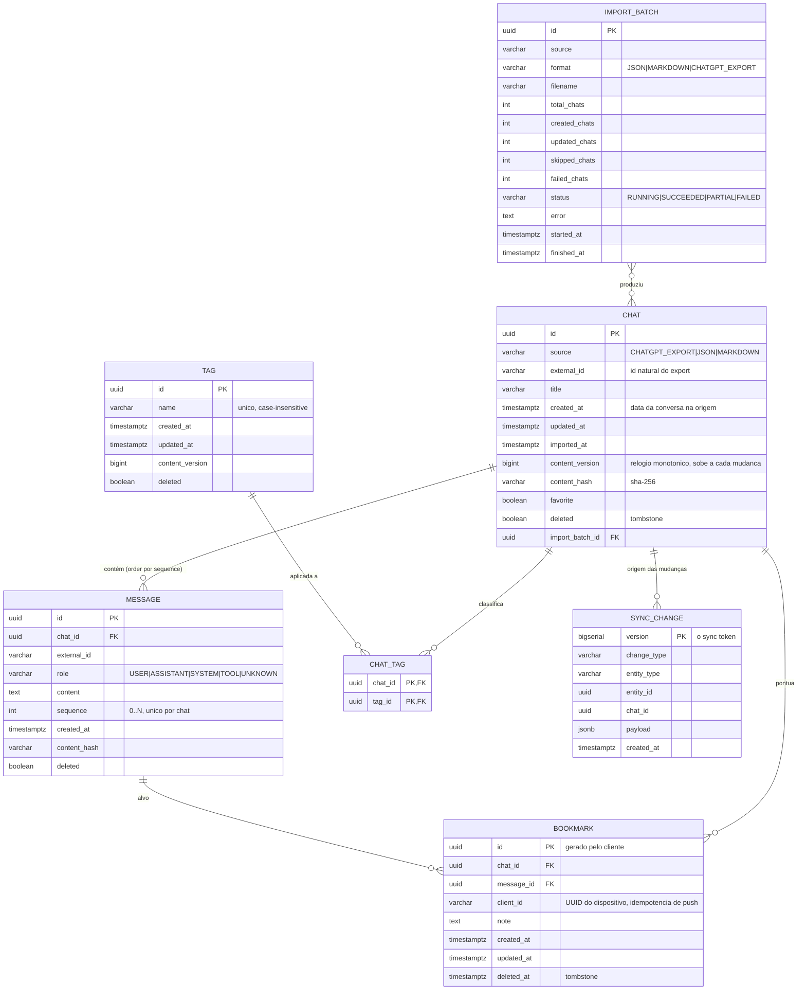

# Modelo de Domínio

> Status: modelo-alvo aprovado na Etapa 1. As seções marcadas com **Estado atual**
> descrevem o que já está implementado; o restante (tombstones, `client_id`,
> sync) chega nas Etapas 4–5.

## 1. Diagrama



## 2. Entidades

### 2.1 `Chat`

| Campo           | Tipo          | Notas                                                                   |
|-----------------|---------------|-------------------------------------------------------------------------|
| `id`            | `uuid`        | PK, gerado pela aplicação (`UUID.randomUUID()`) para não depender de extensão do Postgres |
| `source`        | `varchar`     | `CHATGPT_EXPORT`, `JSON`, `MARKDOWN` — origem, não formato                |
| `externalId`    | `varchar`     | id natural do export quando existir; `NULL` quando derivado              |
| `title`         | `varchar(500)`| nunca vazio; fallback `"Conversa sem título — <data>"`                   |
| `createdAt`     | `timestamptz` | timestamp da conversa na origem                                           |
| `updatedAt`     | `timestamptz` | data da mensagem mais recente na origem                                  |
| `importedAt`    | `timestamptz` | quando o backend importou                                               |
| `contentVersion`| `bigint`      | relógio monotônico; incrementa a cada mudança de conteúdo ou flag        |
| `contentHash`   | `varchar(64)` | SHA-256 do conteúdo canônico (§4)                                        |
| `favorite`      | `boolean`     | padrão `false`                                                          |
| `deleted`       | `boolean`     | tombstone; a linha permanece para propagar `CHAT_DELETED`                |
| `importBatchId` | `uuid`        | rastreabilidade da importação                                            |

**Constraint de idempotência** (§12):

```sql
CREATE UNIQUE INDEX uq_chats_source_external ON chats (source, external_id)
  WHERE external_id IS NOT NULL AND deleted = false;
```

O índice é parcial porque (a) chats derivados de Markdown não têm `externalId` e (b) um
`externalId` reaproveitado após deleção não pode colidir com um chat novo.

**Constraint de conteúdo** (evita "atualização" sem mudança real):

```sql
CREATE UNIQUE INDEX uq_chats_content_hash ON chats (source, content_hash);
```

### 2.2 `Message`

| Campo         | Tipo          | Notas                                                     |
|---------------|---------------|-----------------------------------------------------------|
| `id`          | `uuid`        | PK                                                        |
| `chatId`      | `uuid`        | FK `→ chats.id`, `ON DELETE CASCADE` lógico (via `deleted`)|
| `externalId`  | `varchar`     | id na origem quando disponível                            |
| `role`        | `varchar(20)` | ver `Role` (§2.6)                                         |
| `content`     | `text`        | Markdown preservado **sem renderizar** (render é do cliente)|
| `sequence`    | `integer`     | 0..N-1, índice da mensagem na conversa                    |
| `createdAt`   | `timestamptz` | timestamp da mensagem; `NULL` permitido                    |
| `contentHash` | `varchar(64)` | SHA-256 de `role + "\0" + content`                        |

```sql
CREATE UNIQUE INDEX uq_messages_chat_sequence ON messages (chat_id, sequence);
CREATE INDEX idx_messages_chat_created ON messages (chat_id, created_at);
```

`content` é armazenado cru. O Kindle faz o render; o backend só faz full-text e snippet.
Isso mantém o payload de sync compacto e permite melhorar o renderer depois sem
reimportar.

### 2.3 `Role`

```java
public enum Role { USER, ASSISTANT, SYSTEM, TOOL, UNKNOWN }
```

Mapeamento de adaptadores:

| Texto na origem                          | `Role`       |
|------------------------------------------|--------------|
| `user`, `human`, `prompt`, `você`        | `USER`       |
| `assistant`, `gpt`, `model`, `bot`, `chatgpt` | `ASSISTANT` |
| `system`, `developer`                    | `SYSTEM`     |
| `tool`, `function`, `tool_call`          | `TOOL`       |
| qualquer outro / ausente                 | `UNKNOWN`    |

`UNKNOWN` é terminal: nunca falha a importação. A especificação exige explicitamente não
assumir que todos os formatos terão os mesmos papéis.

### 2.4 `Tag`

`name` única **case-insensitive** (índice único em `lower(name)`). `contentVersion`
monotônico para o sync. Um chat pode ter zero ou N tags; tags órfãs são removidas quando o
último chat é desvinculado (evita lixo no catálogo do Kindle).

**Estado atual (Etapa 3):** a tabela `tags` tem `normalized_name` (chave
case-insensitive) e o vínculo `chat_tags (chat_id, tag_id)`. A normalização é
feita por `shared/TagNames` (trim, dedup case-insensitive preservando a grafia da
primeira ocorrência, ordem alfabética, máx. 64 tags de 100 caracteres). Tags vêm
da importação (`NormalizedChat.tags`) e podem ser substituídas via
`PUT /api/chats/{id}/tags`. Tags órfãs ainda **não** são coletadas (fica para o
sync).

### 2.5 `Bookmark`

| Campo       | Notas                                                                     |
|-------------|---------------------------------------------------------------------------|
| `id`        | UUID **gerado pelo cliente Kindle** — torna o push idempotente             |
| `clientId`  | identificador do dispositivo; `UNIQUE (client_id, id)` permite reimportação |
| `chatId`    | denormalizado — permite listar bookmarks de um chat sem JOIN              |
| `messageId` | mensagem alvo                                                            |
| `note`      | opcional, texto livre                                                    |
| `deletedAt` | tombstone em vez de `DELETE` físico                                     |

Bookmark nunca é removido fisicamente: o Kindle precisa aprender que ele sumiu. Um
`INSERT ... ON CONFLICT DO NOTHING` no push torna reenvio seguro.

**Estado atual (Etapa 3):** `bookmarks (id, chat_id, message_id, note, created_at)`,
com FK para `chats`/`messages` e `UNIQUE (chat_id, message_id)`. O `id` é gerado
pelo **backend** e o DELETE é físico (sem `client_id`/tombstone) — o push
idempotente do Kindle chega na Etapa 4. Um bookmark duplicado devolve **409**.

**Limitação conhecida:** uma reimportação que altere o conteúdo recria as
mensagens com novos ids; como o bookmark referencia `message_id` (FK com
`ON DELETE CASCADE`), os bookmarks daquela conversa podem ser removidos nesse
processo. A ser tratado no sync (Etapa 4).

### 2.6 Regras de invariante (domínio)

```java
// Chat
static Chat create(ChatSource source, String externalId, String title, Instant createdAt)
void applyImportedContent(List<Message> messages)  // recalcula updatedAt, contentHash, contentVersion
void rename(String title)
void setFavorite(boolean favorite, Instant when)
void markDeleted()

// Message
static Message of(Role role, String content, int sequence, Instant createdAt)
```

Invariantes garantidas em teste unitário:

1. `title` nunca é `null` nem branco.
2. `sequence` é ≥ 0 e único dentro do chat.
3. `contentVersion` é estritamente crescente a cada `applyImportedContent` ou
   `setFavorite`.
4. `contentHash` é determinístico para a mesma entrada.
5. `markDeleted()` é idempotente e nunca decrementa `contentVersion`.
6. `Chat` sem `externalId` nunca colide com outro `Chat` sem `externalId`
   (identidade via `contentHash`).

## 3. Value objects e canonicalização

### 3.1 `ContentHash`

```java
public record ContentHash(String value) {
    public static ContentHash of(Chat chat, List<Message> messages) {
        // canonical = "title\0" + join por linha de ("\0" + sequence + "\0" + role + "\0" + hash da mensagem)
        // SHA-256 em UTF-8, saída hex
    }
    public static ContentHash ofMessage(Role role, String content) { ... }
}
```

A canonicalização **ordena por `sequence`**, não por timestamp, para ser estável mesmo com
timestamps ausentes ou duplicados em exports reais.

### 3.2 `NormalizedChat` (resultado dos importadores)

Contrato entre a camada de importação e a aplicação. É o **único** formato que entra no
domínio — é aqui que "ChatGPT" deixa de existir.

```java
public record NormalizedChat(
    String externalId,
    String title,
    Instant createdAt,
    Instant updatedAt,
    List<NormalizedMessage> messages,
    Set<String> tags
) {}

public record NormalizedMessage(
    String externalId,
    Role role,
    String content,
    Instant createdAt
) {}
```

## 4. Idempotência de importação (§12)

Algoritmo por chat, dentro de **uma transação por chat**:

```text
1. h = ContentHash(canonical do NormalizedChat)
2. existe chat ativo com (source, externalId)?
   não  → INSERT chat + messages                        → created++
   sim  → c = encontrado
           c.contentHash == h ?  → nada                → skipped++
           c.messages.size == n && todos hash iguais?
             não → DELETE messages, INSERT novas, bump version → updated++
             sim → nada                                 → skipped++
3. tags: resolver por nome, criar ausentes, vincular, desvincular as removidas
4. escrever 1 linha em sync_change_log (CHAT_CREATED ou CHAT_UPDATED) + bump contentVersion
```

Reprocessar o mesmo arquivo produz `created=0, updated=0, skipped=N`. Teste de integração
com Testcontainers cobre exatamente esse cenário.

## 5. Busca (§13)

A busca é sempre **no backend, paginada** (§38). O Kindle faz busca local separada.

**Estado atual (Etapa 3):** full-text nativo do PostgreSQL com a configuração
`simple` (sem stemming; serve pt e en). As colunas geradas `title_tsv`
(`chats.title`) e `content_tsv` (`messages.content`) são `tsvector` STORED com
índices GIN (migração `V5`).

| Tipo    | Como casa                                                              |
|---------|------------------------------------------------------------------------|
| Título  | `chats.title_tsv @@ plainto_tsquery('simple', :q)`                      |
| Conteúdo| `messages.content_tsv @@ plainto_tsquery('simple', :q)`                 |
| Tag     | `EXISTS (… tags t WHERE t.normalized_name = lower(btrim(:q)))`          |

Snippet com `ts_headline('simple', …, plainto_tsquery('simple', :q))`; a marcação
`<mark>` é removida no `SearchService` (o Kindle renderiza texto puro). Quando o
casamento é por conteúdo, cada mensagem correspondente vira um resultado; quando é
apenas por título/tag, devolvemos um único resultado por conversa (primeira
mensagem como referência), evitando repetir o chat. Ordenação por
`bucket, ts_rank DESC, created_at DESC NULLS LAST`, paginada por `page`/`size`.

**Modelo-alvo (Etapas futuras):** `pg_trgm` para tolerar erro de digitação,
`websearch_to_tsquery('portuguese', …)`, colapso por `DISTINCT ON (c.id)`
mantendo o snippet de maior `ts_rank` e paginação por **keyset**
(`after=<cursor>` base64 de `(rank, updatedAt, chatId)`) para evitar `OFFSET`
grande.

## 6. Change log e token de sync (§15/16)

O token **é** a coluna `sync_change_log.version`, gerada por `BIGSERIAL` — nunca pelo
servidor Java, para continuar valendo após restart. Tabela `V6`:

| Campo             | Tipo          | Notas                                                     |
|-------------------|---------------|-----------------------------------------------------------|
| `version`         | `bigserial`   | PK; é o `syncToken` do cliente                            |
| `change_type`     | `varchar(30)` | `CHAT_*`, `MESSAGE_*`, `TAG_*`, `BOOKMARK_*`               |
| `entity_type`     | `varchar(20)` | `CHAT`, `MESSAGE`, `TAG`, `BOOKMARK`                       |
| `entity_id`       | `uuid`        | entidade afetada (basta para remoções)                    |
| `chat_id`         | `uuid`        | chat relacionado, quando houver                          |
| `content_version` | `bigint`      | versão do conteúdo no momento da mudança                  |
| `created_at`      | `timestamptz` | base da retenção                                          |

O log guarda **só metadados**: o payload é montado na leitura, a partir do estado atual
([sync-protocol](sync-protocol.md) §4.1). Assim ele não duplica conteúdo de mensagem e o
cliente nunca recebe um retrato congelado no passado.

Escritas no log (registradas na **mesma transação** do dado que as motivou, via
`ChangeLogWriter`): criação/atualização de chat pela importação, favorito, tags,
`DELETE` de chat, criação/remoção de bookmark e `POST /api/tags`. No-ops (favoritar
pelo mesmo valor, repetir o mesmo conjunto de tags) **não** geram evento.

Retenção: 30 dias **ou** 1.000.000 de linhas (`keepLatest`), aplicada uma vez por
requisição de sync.

## 7. Modelo do lado Kindle (SQLite)

Réplica de leitura, nãoespelho exato. Colunas extras locais que **nunca** são sincronizadas
(ADR-005):

```sql
CREATE TABLE chats (
  id TEXT PRIMARY KEY,
  title TEXT NOT NULL,
  source TEXT, external_id TEXT,
  created_at INTEGER, updated_at INTEGER, imported_at INTEGER,
  content_hash TEXT, content_version INTEGER,
  favorite INTEGER NOT NULL DEFAULT 0,
  deleted INTEGER NOT NULL DEFAULT 0,
  message_count INTEGER NOT NULL DEFAULT 0,   -- local, evita COUNT(*) por página
  last_opened_at INTEGER                        -- local, "continue lendo"
);

CREATE TABLE messages (
  id TEXT PRIMARY KEY,
  chat_id TEXT NOT NULL,
  role TEXT NOT NULL, sequence INTEGER NOT NULL,
  content TEXT NOT NULL, created_at INTEGER,
  UNIQUE (chat_id, sequence)
);

CREATE TABLE bookmarks (
  id TEXT PRIMARY KEY, client_id TEXT NOT NULL,
  chat_id TEXT NOT NULL, message_id TEXT NOT NULL,
  note TEXT, created_at INTEGER, deleted_at INTEGER
);

CREATE TABLE sync_state (key TEXT PRIMARY KEY, value TEXT);   -- last_version, last_sync_at
CREATE TABLE pending_changes (seq INTEGER PRIMARY KEY AUTOINCREMENT,
                              change_type TEXT, payload TEXT, created_at INTEGER);
```

`last_read_message` é mantido em `sync_state` por chat (chave `read:<chatId>`) — é estado
de leitura local e não faz parte do contrato de sync.

## 8. Referências

- [ADR-005 — Backend source of truth](decisions/ADR-005-backend-source-of-truth.md)
- [ADR-003 — Protocolo de sync](decisions/ADR-003-sync-protocol.md)
- [sync-protocol.md](sync-protocol.md)
