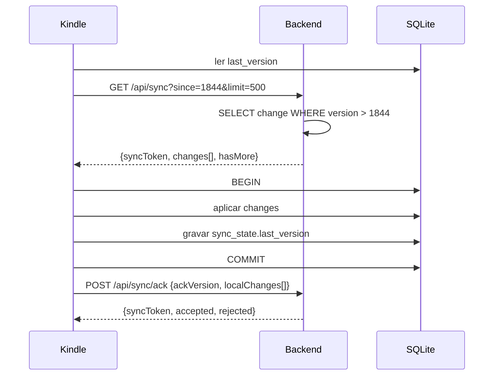
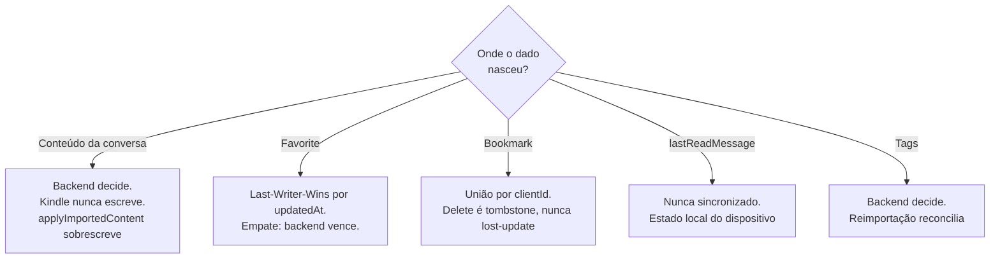

# Protocolo de Sincronização

> Status: **implementado** (Etapa 4).
> Decisão registrada em [ADR-003](decisions/ADR-003-sync-protocol.md).
> Contrato HTTP em [api.md](api.md) § Sincronização.

## 1. Princípios

1. **Incremental.** O backend nunca reenvia tudo. Só o que mudou após o token do cliente.
2. **Ordenado e total.** Todo evento tem um `version` monotônico. Não há lacunas.
3. **Idempotente.** Aplicar o mesmo delta duas vezes converge para o mesmo estado.
4. **Detectável.** Se o token do cliente for antigo demais, o servidor diz explicitamente
   e o cliente faz full snapshot.
5. **Pull apenas.** O Kindle **nunca** recebe push. Ele puxa por ação do usuário.
6. **Tombstone.** Nada é apagado fisicamente enquanto um cliente possa precisar saber.

## 2. O sync token

O token **é** a coluna `sync_change_log.version`, gerada por uma sequência do Postgres
(`BIGSERIAL`). Um inteiro monotônico global:

```text
1842 → 1843 → 1844 ...
```

Por que não `updated_at`:

- `updated_at` tem precisão de microssegundo e **colisões** são possíveis em lote;
- não representa ordenação estável quando o relógio do servidor se ajusta;
- `DELETE` físico não deixa rastro;
- dois clientes que sincronizam no mesmo instante podem ver a mesma linha com
  `updated_at` igual e pular um evento.

Por que não replicação lógica do Postgres: é mais pesada, exige setup e não é portável
entre as 3 versões de Postgres suportadas. Para um MVP de usuário único, uma tabela de
change log explícita é mais simples de reasonar e de testar.

O cliente armazena em `sync_state`:

```text
last_version = 1844
```

## 3. Fluxo



## 4. `GET /api/sync`

```http
GET /api/sync?since=1844&limit=500
Authorization: Bearer <jwt>
```

| Parâmetro | Padrão | Limite | Descrição                                                     |
|-----------|--------|--------|---------------------------------------------------------------|
| `since`   | `0`    | —      | última versão aplicada. `0`/ausente = ainda não tenho nada    |
| `limit`   | `200`  | 1000   | máximo de mudanças por página                                 |

### 4.1 Resposta 200

```json
{
  "syncToken": 2310,
  "hasMore": true,
  "fullResyncRequired": false,
  "serverTime": "2026-09-29T15:10:00Z",
  "changes": [
    {
      "version": 2305,
      "type": "CHAT_UPDATED",
      "entityType": "CHAT",
      "entityId": "0f9c1c9a-1b2c-4d3e-8f10-aabbccddeeff",
      "chatId": "0f9c1c9a-1b2c-4d3e-8f10-aabbccddeeff",
      "contentVersion": 8,
      "createdAt": "2026-09-29T15:09:00Z",
      "chat": {
        "id": "0f9c1c9a-1b2c-4d3e-8f10-aabbccddeeff",
        "title": "Spring Transactional",
        "source": "CHATGPT_EXPORT",
        "externalId": "c-42",
        "createdAt": "2026-09-20T14:00:00Z",
        "updatedAt": "2026-09-27T18:30:00Z",
        "importedAt": "2026-09-28T09:00:00Z",
        "contentVersion": 8,
        "contentHash": "9f2b...",
        "favorite": false,
        "messageCount": 87,
        "tags": [
          { "id": "…", "name": "Java" },
          { "id": "…", "name": "Spring" }
        ],
        "messages": [
          {
            "id": "...",
            "role": "USER",
            "sequence": 0,
            "createdAt": "2026-09-20T14:00:00Z",
            "contentHash": "1a2b...",
            "content": "…"
          }
        ],
        "messagesOmitted": false
      }
    },
    {
      "version": 2306,
      "type": "CHAT_DELETED",
      "entityType": "CHAT",
      "entityId": "77aa...",
      "chatId": "77aa..."
    },
    {
      "version": 2307,
      "type": "TAG_CREATED",
      "entityType": "TAG",
      "entityId": "tag-id",
      "tag": { "id": "tag-id", "name": "Arquitetura" }
    },
    {
      "version": 2310,
      "type": "BOOKMARK_DELETED",
      "entityType": "BOOKMARK",
      "entityId": "bm-1",
      "chatId": "0f9c...",
      "bookmark": null
    }
  ]
}
```

O change log guarda **só metadados** (quem mudou, quando, versão do conteúdo). O
payload é montado na leitura, a partir do estado atual: o log não duplica conteúdo
de mensagem e o cliente nunca recebe um retrato congelado no passado.

### 4.1.1 O que o MVP emite

| Origem da mudança | Evento |
|-------------------|--------|
| importação cria conversa | `CHAT_CREATED` |
| importação altera conteúdo/tags | `CHAT_UPDATED` |
| `PUT /api/chats/{id}/favorite`, `PUT /api/chats/{id}/tags` | `CHAT_UPDATED` |
| `DELETE /api/chats/{id}` | `CHAT_DELETED` |
| `POST /api/bookmarks` | `BOOKMARK_CREATED` |
| `DELETE /api/bookmarks/{id}` | `BOOKMARK_DELETED` |
| `POST /api/tags` (tag nova) | `TAG_CREATED` |

Duas decisões que valem registro:

- **Tag criada junto com uma conversa não gera `TAG_CREATED`.** O `id` e o `nome`
  já vêm no payload do chat, e o snapshot entrega o catálogo inteiro. O evento
  existe para a tag que o usuário cria pela API e ainda não está em nenhum chat.
- **`MESSAGE_*` não são emitidos.** Ver §4.2.
- Favoritar para o mesmo valor, ou trocar tags pelo mesmo conjunto, **não** geram
  evento: são no-ops, e o log de um Kindle que repete ações não deve inchar.

### 4.2 Semântica por tipo

| `type`              | Efeito no Kindle                                                       |
|---------------------|------------------------------------------------------------------------|
| `CHAT_CREATED`      | `INSERT OR REPLACE` em `chats` + `messages` + `chat_tags`               |
| `CHAT_UPDATED`      | upsert; **substitui** `messages` inteira quando `contentVersion` maior |
| `CHAT_DELETED`      | `UPDATE chats SET deleted=1`; some da biblioteca, dados ficam no disco   |
| `TAG_CREATED`/`_UPDATED` | upsert em `tags`                                     |
| `TAG_DELETED`       | remove da lista de tags                                                |
| `BOOKMARK_CREATED`/`_UPDATED` | upsert em `bookmarks`                                  |
| `BOOKMARK_DELETED`  | `UPDATE bookmarks SET deleted_at`                                      |
| `MESSAGE_*`         | reservados; o MVP substitui o conjunto inteiro de mensagens (§8)       |

`MESSAGE_DELETED` e `MESSAGE_UPDATED` existem no enum desde já, para o futuro. No MVP um
chat alterado chega com `messages` completas — para conversas deeczenas a centenas de
mensagens isso é mais simples e mais barato de aplicar do que diffs parciais, e o Kindle
aplica em transação.

### 4.3 `hasMore` e paginação do delta

O servidor devolve no máximo `limit` mudanças. Se sobrar, `hasMore = true` e o cliente
repete com `since = syncToken`. Um sync completo pode ser várias requisições — importante
porque um arquivo de 10 MB não deve ser carregado de uma vez no Kindle.

### 4.4 Full resync

`fullResyncRequired: true` significa **"o delta não entrega o estado inteiro"**; o cliente
precisa do snapshot. O servidor pede isso em dois casos:

1. **`since = 0` (cliente sem token).** O delta desde a versão 1 só valeria se o log
   guardasse *toda* a história — e a retenção de 30 dias (§9) garante que não guarda.
   Sem esse cuidado, um Kindle novo receberia `changes: []` e abriria uma biblioteca
   vazia.
2. **Token anterior à janela retida:** `since < menorVersaoRetida - 1`, ou seja, há pelo
   menos uma mudança que já saiu do log e que o cliente nunca viu.

```json
{
  "syncToken": 5120,
  "hasMore": false,
  "fullResyncRequired": true,
  "changes": []
}
```

O cliente então chama `GET /api/sync/snapshot` (paginado por chat), **apaga** as tabelas
`chats/messages/tags/chat_tags/bookmarks` locais, aplica o snapshot e grava o
`syncToken`. Nenhum estado de leitura local (`sync_state.read:*`) é apagado.

O snapshot **reserva uma versão antes de ler os dados**: uma mudança que caia no meio
da leitura fica acima do token devolvido e volta no delta seguinte, em vez de sumir
entre as páginas. Como remoções são tombstones, o cliente reconstrói o estado.

Essa reserva também garante que `syncToken` **nunca seja `0`**: um backend sem nenhuma
mudança ainda assim entrega um token utilizável, então o cliente novo não fica preso
pedindo snapshot a cada ciclo (com `syncToken: 0` ele nunca sairia de
`fullResyncRequired`).

`GET /api/sync/snapshot?page=0&size=50`:

```json
{
  "syncToken": 5120,
  "page": 0, "size": 50, "total": 3, "last": true,
  "tags": [{ "id": "…", "name": "Java" }],
  "chats": [{ "id": "…", "title": "…", "messageCount": 87, "messages": [], "messagesOmitted": false }],
  "bookmarks": [{ "id": "…", "chatId": "…", "messageId": "…", "note": null, "createdAt": "…" }],
  "bookmarksOmitted": false
}
```

O catálogo de tags vem inteiro (é pequeno); os bookmarks vêm até
`chatreader.sync.max-bookmarks-in-snapshot` (1000) e, se sobrarem,
`bookmarksOmitted: true` manda o cliente completar por `GET /api/bookmarks`.

## 5. `POST /api/sync/ack`

O ACK fecha o ciclo e carrega as escritas que o Kindle fez offline.

```http
POST /api/sync/ack
Authorization: Bearer <jwt>
Content-Type: application/json
```

```json
{
  "ackVersion": 2310,
  "clientId": "kobo-clara-2f9a",
  "localChanges": [
    { "type": "BOOKMARK_CREATED", "payload": { "id": "b1f0...", "chatId": "0f9c...", "messageId": "m-42", "note": "exemplo canônico" } },
    { "type": "BOOKMARK_DELETED", "payload": { "id": "b0a1..." } },
    { "type": "CHAT_FAVORITE", "payload": { "chatId": "0f9c...", "favorite": true } }
  ]
}
```

```json
{
  "ackVersion": 2310,
  "syncToken": 2310,
  "accepted": 3,
  "rejected": 0,
  "rejections": []
}
```

Regras do ACK:

- `ackVersion` é **informativo**. O estado de sync real é o `syncToken` devolvido; o ACK
  serve para o servidor registrar observabilidade e detectar cliente atrasado.
- **O `syncToken` devolvido pelo ACK não vira o token do cliente.** Ele é a versão do
  servidor *depois* de aplicar as escritas, e pode incluir mudanças de outro dispositivo
  que este Kindle ainda não baixou: adotar esse valor pularia essas mudanças. O token do
  cliente só avança no `GET /api/sync`. Na prática: o ciclo termina no pull, o ACK sobe
  as escritas locais, e o próximo pull traz de volta o que o próprio ACK gravou — o que
  é idempotente e ainda serve de conferência.
- Cada `localChange` é aplicada **independentemente**: uma rejeição não desfaz as demais.
- Resposta por item rejeitado:

```json
{ "rejections": [ { "index": 1, "reason": "NOT_FOUND", "message": "Mensagem nao encontrada no chat 0f9c: m-9" } ] }
```

`reason` é `NOT_FOUND`, `CONFLICT`, `INVALID` ou `REJECTED`.

- O Kindle **só remove** o item de `pending_changes` quando o ACK retorna 2xx **e** o item
  não está em `rejections`. Reenvio é permitido e seguro. Um item recusado **fica na
  fila** (com o motivo para a tela mostrar) em vez de ser descartado: um `NOT_FOUND`
  pode ser o caso da conversa ainda não ter chegado no pull anterior.
- **JSON inválido não é recusa por item**: `type` desconhecido ou campo obrigatório
  ausente devolve **400** para a requisição inteira. Recusa existe para falha de
  negócio, não para payload que o servidor nem consegue ler.

## 6. Escritas do Kindle → backend

| Mudança local      | Endpoint                | Idempotência                       |
|--------------------|-------------------------|------------------------------------|
| Favoritar chat     | `PUT /api/chats/{id}/favorite` | valor absoluto, reenviar = no-op |
| Bookmark           | `POST /api/bookmarks`   | `id` gerado pelo cliente; reenvio devolve o existente |
| Remover bookmark   | `DELETE /api/bookmarks/{id}` | DELETE idempotente (item ausente é aceito) |
| Renomear chat      | —                       | fora do MVP (§6, nota abaixo) |

O ACK **não** chama esses endpoints: ele passa pelos mesmos serviços de aplicação
(`BookmarkService.createFromClient`, `deleteFromClient`, `ChatService.setFavorite`),
com id do cliente preservado. Assim o caminho offline e o caminho HTTP têm a mesma
semântica de idempotência, sem duplicar regra de negócio.

Renomear e editar tags **não** fazem parte do MVP offline: só o backend os altera, via API
ou reimportação. Isso evita o problema de merge de LWW em texto.

## 7. Resolução de conflitos (ADR-005)



Detalhamento:

- **Conteúdo (título + mensagens + tags)**: o backend é a **única** fonte. O Kindle nunca
  escreve conteúdo. Se o cliente enviar algo assim, o item volta em `rejections` com
  `reason: CONFLICT` (e o log registra), e o delta seguinte traz o estado correto.
- **Favorite**: LWW por `updatedAt` (ISO-8601, UTC). Em empate exato, o backend prevalece
  (regra determinística, sem relógio do cliente na decisão). Cada transição gera um evento
  de sync, então o resultado converge nos dois lados.
- **Bookmark**: modelo **union** com tombstones. Dois dispositivos marcando mensagens
  diferentes resultam em dois bookmarks, não em um sobrescrever o outro. Remoção nunca é
  física enquanto o outro dispositivo puder reenviar.
- **Estado de leitura** (`lastReadMessage`, `lastOpenedAt`): deliberadamente **fora** do
  contrato de sync. É por dispositivo e não tem valor de leitura entre dispositivos.
- **Relógio**: o servidor nunca usa o timestamp do cliente para decidir ordem, só para
  desempatar LWW. O relógio do Kindle costuma estar errado por minutos ou horas.
- **Limitação conhecida (reimportação)**: quando uma reimportação altera o conteúdo, as
  mensagens são recriadas com **novos ids** — é o que faz o `contentHash` decidir que
  houve mudança. Os bookmarks que apontavam para os ids antigos são perdidos junto com
  eles (a FK tem cascade). O impacto é restrito ao dispositivo que apontou a conversa:
  ele recebe `BOOKMARK_DELETED` no delta seguinte e o usuário recria o marcador se quiser.
  A correção (preservar ids por `contentHash` da mensagem) fica para quando houver um
  segundo dispositivo de verdade.

## 8. Resiliência

| Falha                              | Comportamento                                                   |
|------------------------------------|-----------------------------------------------------------------|
| Sem rede                           | Sync é adiado; leitura continua do SQLite                       |
| Timeout HTTP                       | 15 s; falha gravada em `sync_state.last_error`; retry só manual |
| Resposta 401                       | Plugin mostra "faça login novamente" e limpa o token do cliente |
| Resposta 409                       | Conflito de conteúdo; client pede full resync                   |
| Item recusado no ACK               | `rejections[].reason = CONFLICT`; o delta seguinte traz o estado correto |
| Resposta 413 (payload grande)      | Client reduz `limit` e tenta de novo                            |
| Mudança aplicada 2×                | Upserts são idempotentes; `version` já avançou                 |
| Cliente caiu no meio do sync       | Tudo em **uma transação**; SQLite não tem log de mudança meio aplicada |
| Backend reiniciou                  | Sequência persiste; token continua válido                       |

O ponto crítico é a transação: aplicar um delta e gravar `last_version` no mesmo
`BEGIN/COMMIT`. Sem isso, um crash entre os dois faz o cliente pular mudanças.

## 9. Limites e custos

| Métrica                     | Valor / comportamento                                     |
|-----------------------------|-----------------------------------------------------------|
| `limit` máximo              | 1000 mudanças por requisição                              |
| Tamanho de resposta         | acima de `max-messages-per-change` (200) o chat vem **sem** mensagens, com `messagesOmitted=true`, e o cliente busca páginas sob demanda |
| Retenção do change log      | 30 dias ou 1.000.000 de linhas (o que vier primeiro)     |
| First sync (10k chats)      | ~200 requisições de delta, ~10 requisições de snapshot     |
| Sync incremental típico     | 1 requisição, < 5 KB                                      |

Configurável por `chatreader.sync.*` (`SYNC_*` no ambiente): `default-limit`,
`max-limit`, `retention-days`, `max-messages-per-change`,
`snapshot-default-page-size`, `max-bookmarks-in-snapshot`, `max-log-rows`.

A poda roda **uma vez por requisição de sync**, dentro da única janela em que o
servidor escreve durante um pull, e o `keepLatest` só corta o que é antiga demais
para qualquer token plausível.

**Limitação conhecida (janela totalmente podada).** Se a retenção remove *todas* as
linhas, o servidor não consegue provar que houve buraco: um log vazido é indistinguível
de "nada mudou". Nesse caso ele **não** pede full resync — partir de `since=0` seria
exigir o snapshot sempre, e um cliente novo ficaria preso. Quem fecha a lacuna é o
cliente: guardando `lastSyncAt`, ele refaz o snapshot quando o intervalo passa de
`retentionDays` (30 dias). A Etapa 5 implementa essa regra em
`sync_state.last_sync_at`.

O campo `messagesOmitted` é o mecanismo que impede a Etapa 5 de carregar uma conversa
inteira na memória: se a conversa tem 3.000 mensagens, o sync entrega título, contagem e
tags; a tela de leitura pede páginas de 20 via `GET /api/chats/{id}/messages`.

## 10. Versionamento

O caminho `/api/sync` fica versionado por evolution, não por URL (`/api/v1`). O campo
`syncToken` é opaco para o cliente: o Kindle **nunca** interpreta o número, apenas o
repassa. Isso permite trocar `BIGSERIAL` por ULID ou por string no futuro sem alterar o
cliente. Uma_future_ versão com breaking change usa `/api/v2`.
